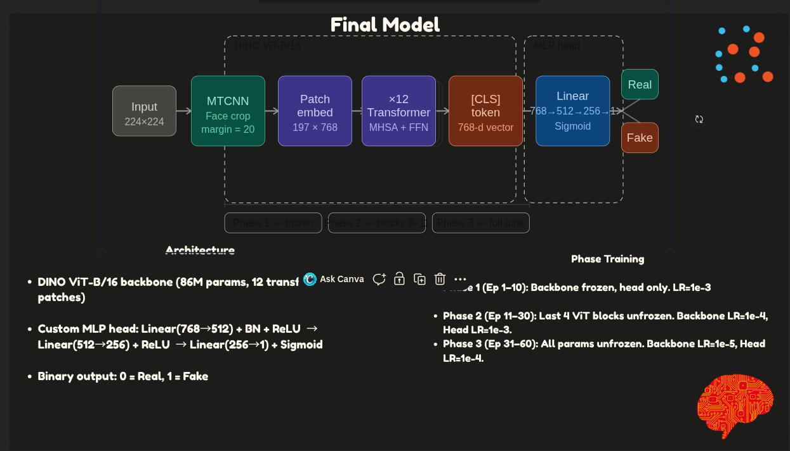

# Deepfake Detection — Comprehensive Model Suite

This repository contains the structured implementation of multiple deep learning models designed for robust deepfake detection. The project explores both spatial (image-level) and temporal (video-level) detection strategies, leveraging cutting-edge architectures like Vision Transformers (ViT), Self-Supervised Learning (SimCLR), and Recurrent Neural Networks (LSTM/GRU).

All code in this submission directory has been cleaned and structured to adhere strictly to academic/project submission guidelines.

---

## 1. Motivation and Overview

Deepfakes pose a significant threat to digital trust. Traditional Convolutional Neural Networks (CNNs) often fail to detect subtle spatial artifacts or temporal inconsistencies across frames. This project addresses these shortcomings by:
1. Extracting **frequency-domain features** using Fast Fourier Transforms (FFT) to catch upsampling artifacts.
2. Utilizing **Vision Transformers (DINO ViT-B/16)** for superior spatial attention.
3. Incorporating **Self-Supervised Learning (SSL)** to learn robust representations without heavy reliance on labels.
4. Extending detection to the **temporal domain** for videos using GRU/LSTM networks on top of ViT backbones.

---

## 2. Models Included

This repository contains the following approaches, each contained in its own module:

### Image-Level Detection (140k Real and Fake Faces Dataset)
* **`model1_fft/`**: A strong frequency-domain baseline. It applies a Fast Fourier Transform to extract log-spectrums from images, which are then passed through a ResNet-18 architecture.
* **`model4_ssl_fft/`**: An advanced multi-modal approach. It utilizes Self-Supervised Learning (SimCLR) to pre-train a ResNet-50 backbone. This is then combined with an FFT branch and Cross-Attention mechanisms. It also includes `grandcam.py` to generate Grad-CAM heatmaps to visualize exactly what the model focuses on when predicting "Fake."
* **`model5_baseline/`**: A direct PyTorch port of a popular Keras baseline ResNet-50 model. It serves as a benchmark to evaluate the performance gains of the custom architectures.

### Video-Level Temporal Detection
* **`Master_Video_Dataset/`**: This directory contains our temporal video processing approach. 
  - Instead of looking at single images, it extracts a sequence of frames from a video.
  - It passes each frame through a **frozen DINO ViT-B/16 backbone** to extract rich 768-dimensional spatial feature vectors.
  - These vectors are fed sequentially into a **Recurrent Neural Network (LSTM or GRU with Attention)** to detect temporal inconsistencies—flickering, unnatural micro-expressions, or sudden lighting changes—that frame-by-frame models miss.
  - Includes an interactive `app.py` for testing.

---

## 3. Core Dependencies & Scripts

At the root of the project, you'll find the shared utility files:

- **`deepfake_utils.py`**: Contains the core PyTorch `Dataset` classes (`FolderDeepfakeDataset`, `CSVDeepfakeDataset`, `VideoSequenceDataset`), custom data augmentations/transforms, and metrics computation logic (AUC, F1, Accuracy).
- **`utils.py`**: General helper functions for I/O and configuration.
- **`evaluate.py`**: A standalone script for running inference and generating ROC curves on test datasets.
- **`requirements.txt`**: List of all Python dependencies required to run the code.

---

## 4. Theory and Architecture


*(Please place your pasted architecture image here as `architecture.png`)*

### DINO ViT-B/16 Architecture
Our most powerful models utilize a highly effective Vision Transformer approach:
- **Input**: 224x224 cropped face images.
- **Preprocessing**: MTCNN Face crop (margin = 20) ensures the model focuses entirely on facial features.
- **Backbone**: DINO ViT-B/16 (86 Million parameters, 12 transformer patches).
  - Patch embedding maps the image into (197 x 768) tokens.
  - Processes through 12 Transformer blocks (Multi-Head Self Attention + Feed Forward Networks).
  - The final spatial representation is extracted via the `[CLS]` token (768-d vector).
- **Custom MLP Head**: 
  - `Linear(768 → 512)` + `BatchNorm` + `ReLU`
  - `Linear(512 → 256)` + `ReLU`
  - `Linear(256 → 1)` + `Sigmoid`
- **Output**: Binary classification probability (`0 = Real`, `1 = Fake`).

### Three-Phase Training Strategy
To prevent catastrophic forgetting of the powerful pre-trained DINO weights, training is carefully orchestrated in three distinct phases:
- **Phase 1 (Epochs 1-10)**: The backbone is completely frozen. Only the custom MLP head is trained. `LR = 1e-3`.
- **Phase 2 (Epochs 11-30)**: The last 4 ViT blocks are unfrozen to allow domain-specific adaptation. Backbone `LR = 1e-4`, Head `LR = 1e-3`.
- **Phase 3 (Epochs 31-60)**: All parameters are unfrozen for end-to-end fine-tuning. Backbone `LR = 1e-5`, Head `LR = 1e-4`.

---

## 5. Datasets Used

- **140k Real and Fake Faces**: Used primarily for training the spatial models (`model1_fft`, `model4_ssl_fft`, `model5_baseline`).
- **Master Video Dataset**: Used for the temporal video-level deepfake detection models, analyzing sequences of frames.

---

## 6. Installation & Usage

```bash
pip install -r requirements.txt
```

To train any of the spatial models, specify the `DATA_ROOT` environment variable pointing to the root of your image dataset, and execute the corresponding `train.py` script.

### Example Commands

First, set your data root:
```bash
export DATA_ROOT=/path/to/dataset/real_vs_fake/real-vs-fake
```

**Run Model 1 (FFT ResNet-18):**
```bash
python model1_fft/train.py --data_root $DATA_ROOT --epochs 30 --batch_size 64
```

**Run Model 4 (SSL SimCLR + FFT):**
```bash
python model4_ssl_fft/train.py --data_root $DATA_ROOT --ssl_epochs 50 --batch_size 32
```

**Run Temporal Video Model:**
```bash
export VIDEO_DATA_ROOT=/path/to/Master_Video_Dataset
python Master_Video_Dataset/train_video.py --data_root $VIDEO_DATA_ROOT --seq_len 10 --batch_size 8
```

> **Note:** To resume training for any model from its latest checkpoint, simply append the `--resume` flag to the command.
